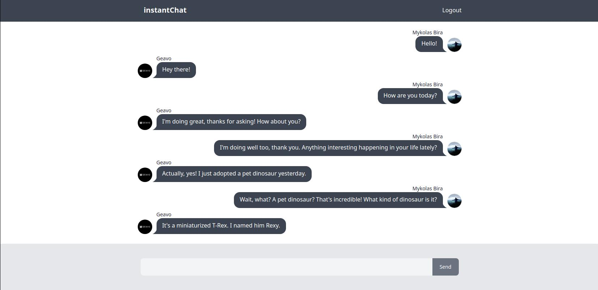

<ins>App Preview</ins>

## Available Scripts

In the project directory, you can run:

### `npm install`

Install All dependencies in this project

### `npm run dev`

Runs the app in the development mode. 

### Built with

- Vite: https://vitejs.dev/
- DaisyUI: https://daisyui.com/
- Tailwind CSS: https://tailwindcss.com/docs/guides/vite
- Firebase Docs: https://firebase.google.com/docs
